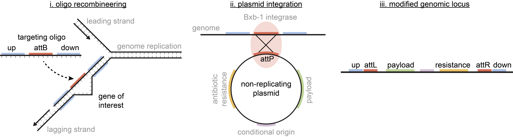
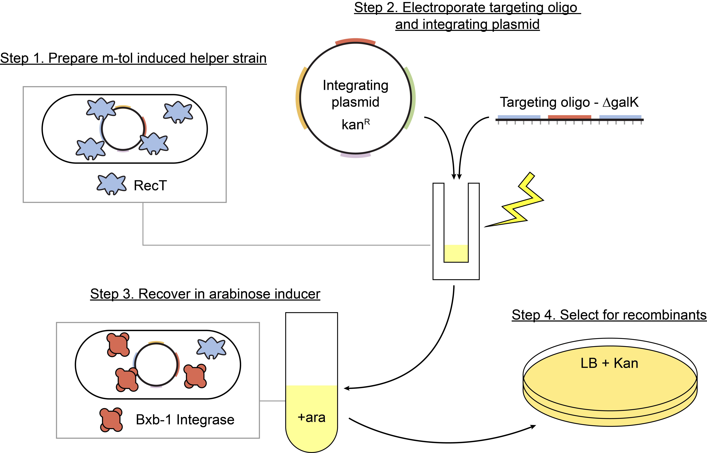
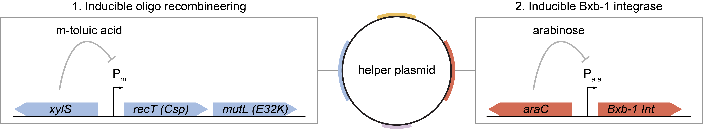
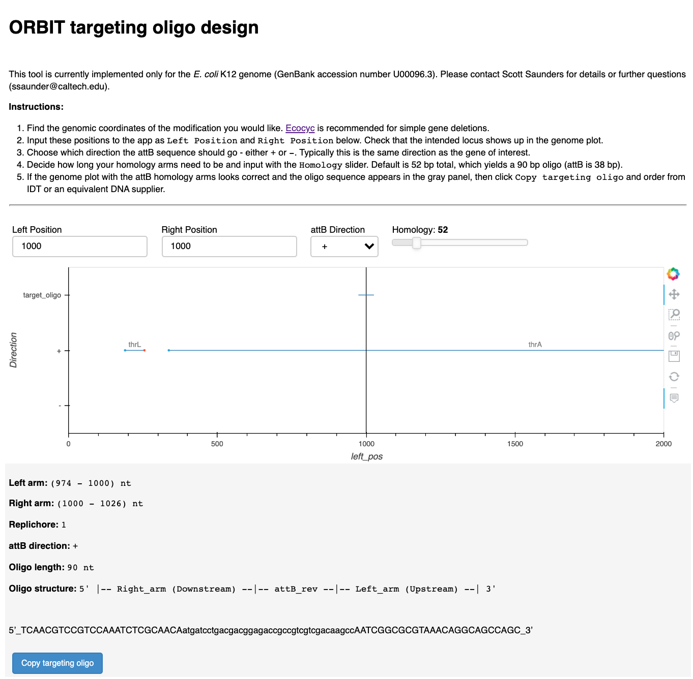
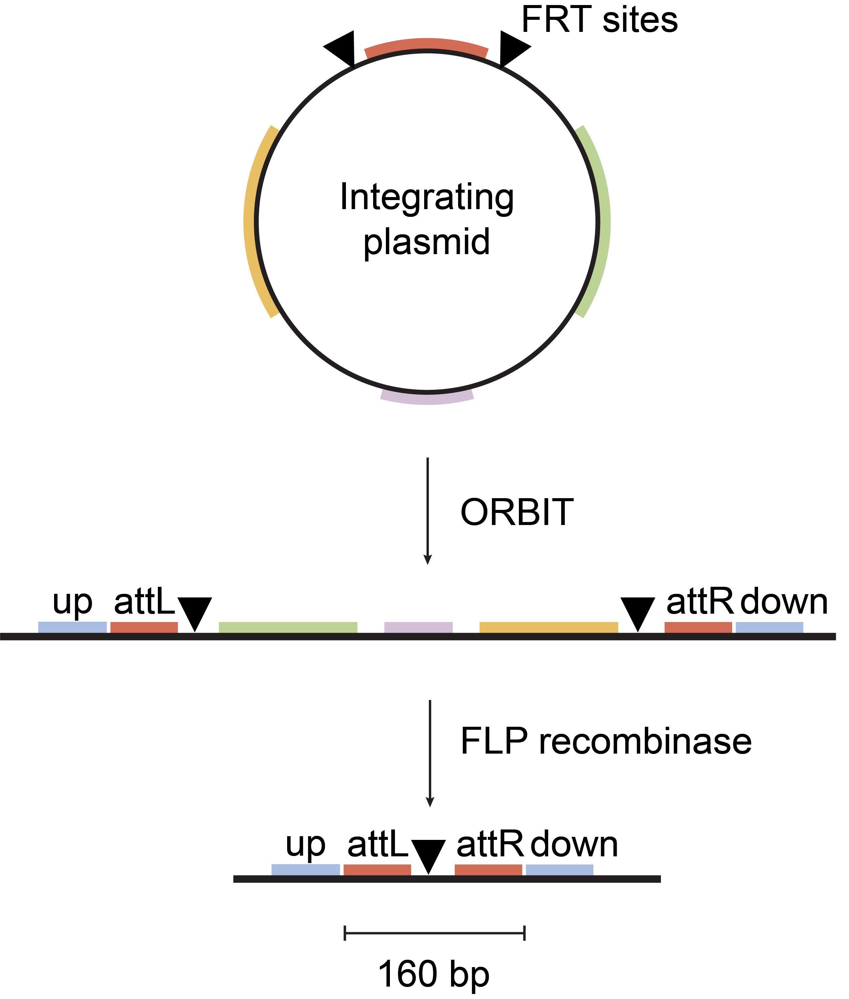

# ORBIT genetics for *E. coli*

**Scott H. Saunders** - Postdoctoral fellow, Rob Phillips Lab, Caltech

*Please contact me at ssaunder@caltech.edu if you have questions or comments. The plan is to post a preprint in the next few months, so any feedback is welcome. Also, please be respectful and do not distribute the plasmid materials without my permission, until this work is preprinted / published. Thanks and Good luck! - Scott*

## Concept

ORBIT was originally developed for use in *Mycobacteria* by Kenan Murphy in a [landmark paper](https://doi.org/10.1128/mBio.01467-18) and it stands for **O**ligo **R**ecombineering followed by **B**xb-1 **I**ntegrase **T**argeting. I have modified and improved this system for use in *E. coli*. 

Single stranded DNA (oligo) recombineering has been used for *E. coli* genetics for almost 20 years (See Donald Court). The central idea is that oligos that contain homology to the genome are bound by a single stranded DNA annealing protein (e.g. Lambda Red Beta), which binds them to a single stranded genomic target during DNA replication. These fragments are thought to act like Okazaki fragments on the lagging strand that are then directly incorporated into genomic strands. 

Small deletions (and insertions) can be made using these oligos, because the homology arms can bind two distinct positions and cause the target strand to loop out. The genomic strands eventually segregate into distinct double stranded genomes and therefore mutants can be identified that have the modification of interest. 

The primary issue with this flavor of genetics, is that unlike traditional reverse genetic methods, there is no antibiotic resistance that can be used to select for recombinants. Oligo based methods are quite efficient, so small mutations can be identified simply by screening colonies (e.g. 10% efficiency means screening only 10 colonies), but this doesn't easily work for larger mutations that occur at lower frequencies (e.g. 0.1% efficiency means screening 1000 colonies). However, if there was a way to incorporate antibiotic selection, then mutations of any size could be specified by an oligo.

ORBIT solves this problem by using a **targeting oligo** that not only contains homology arms, but also a site called **attB**. This is an attachment site that will recombine with the corresponding **attP** site in the presence of the integrase Bxb-1. By putting attP on a non-replicating plasmid, Bxb-1 will insert the plasmid into the newly formed attB locus specified by the targeting oligo. This effectively means that one can specify a mutation with an oligo, but select for recombinants using the antibiotic resistance from the plasmid. The amazing part about this two step process, is that it can be completed in a single co-electroporation with the oligo and the plasmid, making it very convenient.

## Execution

To perform ORBIT you basically need three things:

1. Strain of interest with **helper plasmid**
2. **Targeting oligo**
3. **Integrating plasmid**

Once you have these components, you need to 1) induce the oligo recombineering genes on the helper plasmid and prepare competent cells 2) co-electroporate the targeting oligo and integrating plasmid 3) recover and induce Bxb-1 and 4) plate for recombinants. The protocols in the `/protocols` folder have more details, but if it's successful you should be able to rapidly and efficiently make mutants!

### Helper plasmid

The ORBIT helper plasmid has two separate inducible modules that perform the two conceptual steps of ORBIT. 

First, there is the oligo recombineering module, that includes a single stranded DNA annealing protein (aka RecT) and a mismatch repair suppression protein (dominant negative mutation of MutL - E32K). Temporarily suppressing mismatch repair enables much higher efficiency, and avoids the issues of using mismatch repair mutants that accumulate mutations. This module is induced with xylS, which responds to m-toluic acid. This is inducer cheap and easy to order from [sigma](https://www.sigmaaldrich.com/catalog/product/aldrich/t36609?lang=en&region=US) is soluble in ethanol.

Second, there is the Bxb-1 integrase that catalyzes the integration of the non-replicating plasmid into the attB site. This gene is simply arabinose induced.

Once ORBIT is complete, typically one wants to remove the helper plasmid, so it contains sacB for sucrose counter selection. 

Fully annotated genbank files are available in the `/plasmids` folder.

### Targeting oligo

The targeting oligo has three parts - the upstream homology arm, the downstream homology arm, and the attB site in between. The attB site is 38 bp, and the minimum recommended homology length is 52 bp, which gives a 90 nucleotide (nt) oligo or longer. These oligos can ordered directly from IDT or Sigma and do not require any modifications or special purifications beyond desalting. These oligos can essentially be diluted in water and used as-is, making it very convenient.

For me, oligos 90 or 100 nt are available from IDT and cost \$32 or 55. Oligos 90 - 120 nt are available from Sigma and cost \$18-24. In general, the longer the homology arms, the more efficient ORBIT will be, so I have recently been using 120 nt oligos from Sigma, although IDT oligos of the same length (i.e. both 90 nt) tend to be a bit more efficient.

The targeting oligo should target the lagging strand, and when taking this into account and the possible +/- direction of the attB site thing's quickly become complicated. Therefore I wrote a simple panel app that will let you input genomic coordinates (e.g. from ecocyc) and give you a targeting oligo that specifies that deletion.

See `/targeting_oligo_design_app` for details.

### Integrating plasmid

The final piece of ORBIT is the non-replicating or integrating plasmid. This plasmid contains the **attP** site (48 bp) that Bxb-1 recognizes and integrates into the new genomic attB site. For deletions, it doesn't really matter what is on this plasmid, because most of the plasmid backbone can be excised using the classic FLP recombinase (e.g. pCP20).

However, this integrating plasmid can also be used to insert constructs onto the genome. This is particularly useful for transcriptional reporters, so there is a deriviative of the integrating plasmids that contains a library cloning site flanked by transcriptional terminators. In this case, the entire plasmid backbone, except for the desired construct can be excised with FLP.

In any case, the minimal possible scar is the attL, FRT, and attR sites, which leaves about 160 bp. Clean deletions could be made with a second oligo recombineering step to remove this site, and other strategies may also work in the future.

