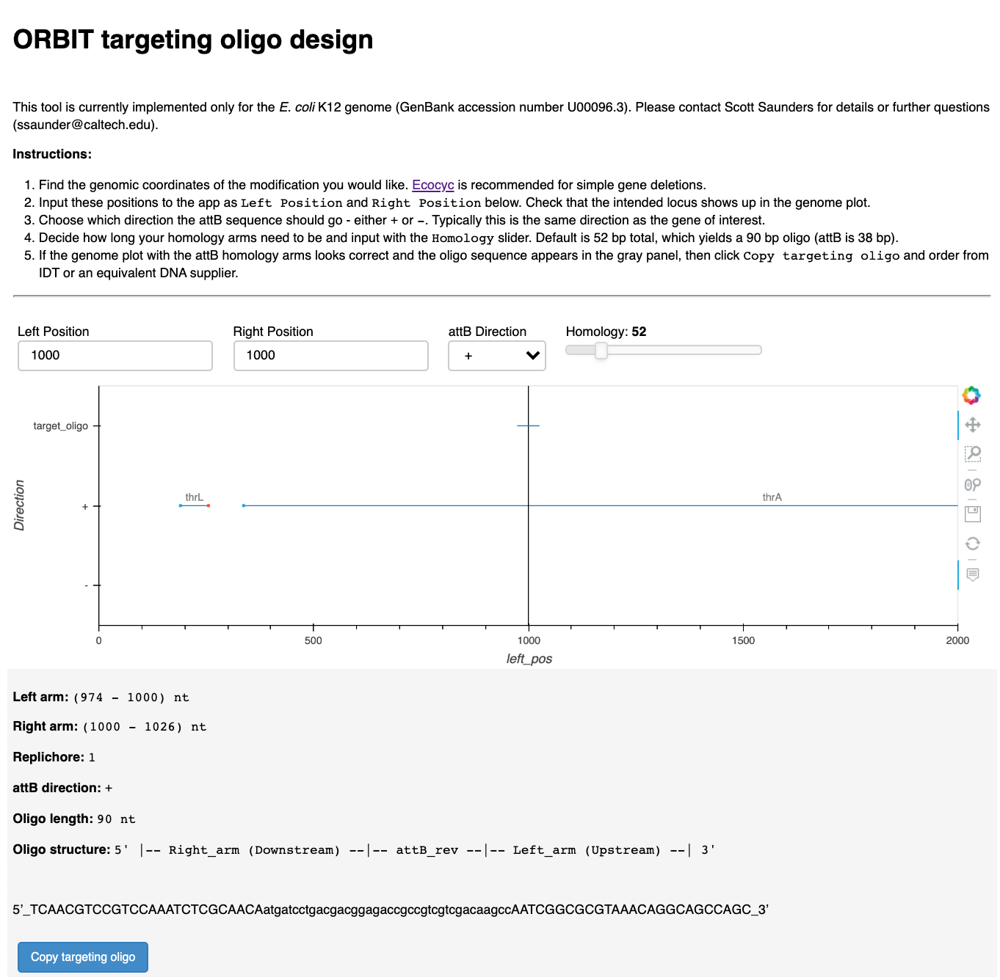

# Targeting Oligo Design

This simple app is used to design targeting oligos for ORBIT. Provide genomic coordinates for your deletion / insertion of interest and it will return an oligo sequence that can be copied and ordered directly from IDT or sigma. 

After you have cloned this repository, make sure that you have the required packages to run the app by running the following code in this folder:

`pip install -r requirements.txt`

Then open the notebook `ORBIT_targeting_oligo_app.ipynb` and run all cells. The design app should open in a new browser tab. 

You can also run this notebook on google colab - click the button at the top. In my experience the app runs a bit slow in the cloud, but it's usable.

